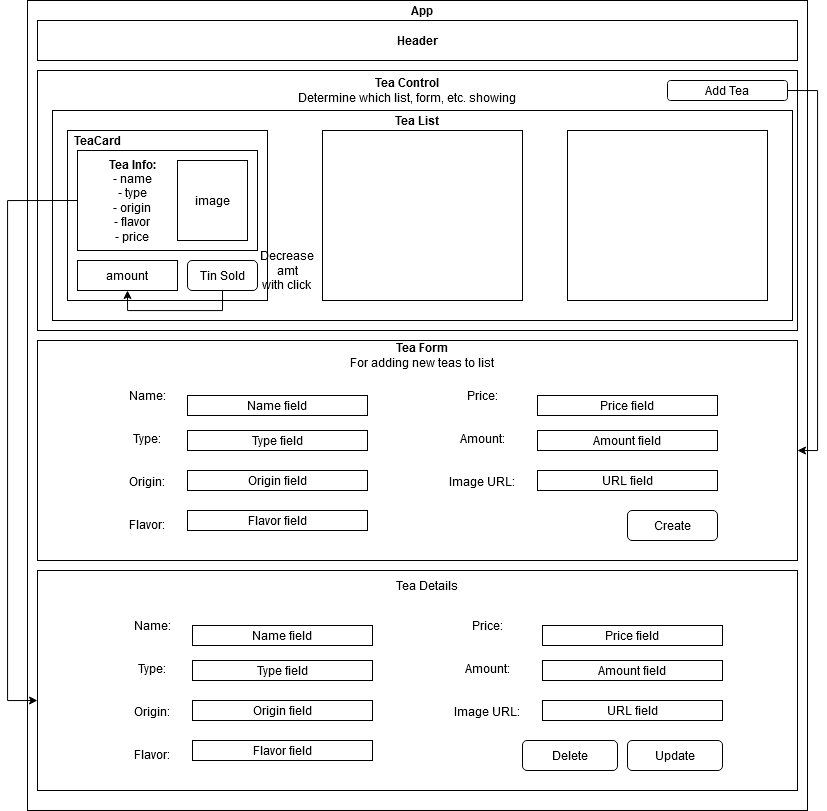

# _[Tea Distributor](https://github.com/TSiu88/#)_

#### _Week 16 Friday Independent Assignment for Epicodus, 04.24.2020_

#### By _**Tiffany Siu**_

<!--  -->

---
## Table of Contents
1. [Description](#description)
    - [Component Diagram](#component-diagram)
2. [Setup/Installation Requirements](#setup/installation-requirements)
    - [Requirements to Run](#requirements-to-run)
    - [Instructions](#instructions)
    - [Other Technologies Used](#other-technologies-used)
3. [Notable Features](#notable-features)
4. [Specifications](#specifications)
    - [User Stories](#user-stories)
    - [Further Exploration](#further-exploration)
5. [Screenshots](#screenshots)
6. [Known Bugs](#known-bugs)
7. [Support and Contact Details](#support-and-contact-details)
8. [License](#license)
---
## Description

This application is the Week 16 Friday independent assignment for Epicodus' full time Intro to Programming and C#/React course. This is an application made to show a React application made with functionality that correctly uses components, states, and properties.  A component diagram is also to be included to show the structure of the components.

### Component Diagram

## Setup/Installation Requirements

### Requirements to Run

* _Web Browser_
* _Webpack_
* _Node.js_
* _NPM_

### Instructions

*This application may be viewed by:*

1. Download and install Node.js from the [official website](https://nodejs.org/en/download/)
2. Clone the [repository](https://github.com/TSiu88/tea-distributor.git) from my [GitHub page](https://github.com/TSiu88)
3. Use a command line/Bash to move to the project directory with `cd project-directory`
4. Run `npm install` to get all dependencies. 
5. Run `npm run start` to start up the program
6. Open [http://localhost:3000](http://localhost:3000) to view it in the browser.

## Other Technologies Used

* _HTML_
* _CSS_
* _Javascript_
* _React_
* _Bootstrap 4.4.1_
* _ESLint_
* _Babel_
* _Jest_
* _Markdown_

## Notable Features
This project uses React to make a clean, well organized page.

## Specifications

### User Stories

  
Click to expand to view User Stories 

  - As a user, I want to see a list/menu of all available kegs. For each keg, I want to see its name, brand, price and alcoholContent (or perhaps something like flavor for a kombucha store).
  - As a user, I want to submit a form to add a new keg to a list.
  - As a user, I want to be able to click on a keg to see its detail page.
  - As a user, I want to see how many pints are left in a keg. Hint: A full keg has roughly 124 pints.
  - As a user, I want to be able to click a button next to a keg whenever I sell a pint of it. This should decrease the number of pints left by 1. Pints should not be able to go below 0.

### Further Exploration

  
Click to expand to viewFurther Exploration topics 

  - [ ] As a user, I want the option to edit a keg's properties after entering them just in case I make a mistake.
  - [ ] As a user, I want to be able to delete a keg.
  - [ ] As a user, I want a keg to update to say "Out of Stock" once it's empty.
  - [ ] As a user, I want kegs with less than 10 pints to include a message that says "Almost Empty" so I can try a pint before it's gone!
  - [ ] As a user, I want to have kegs prices to be color-coded for easy readability. This could be based on their price, the style of beer or kombucha, or the amount of pints left.
  - [ ] As a user, I want this application to be nicely styled. (Use stylesheets and CSS objects!)

## Screenshots

<!-- _Here is a snippet of what the input looks like:_

_Here is a preview of what the output looks like:_

 -->

<!-- 

  
Expand to view More Screenshots 

  

 -->

## Known Bugs

- The buttons to update the quantity on the front page currently not working properly
- Details page functionality not implemented

<!-- _There are currently no known bugs in this program_ -->

## Support and contact details

_If there are any question or concerns please contact me at my [email](mailto:tsiu88@gmail.com). Thank you._

### License

*This software is licensed under the MIT license*

Copyright (c) 2020 **_Tiffany Siu_**