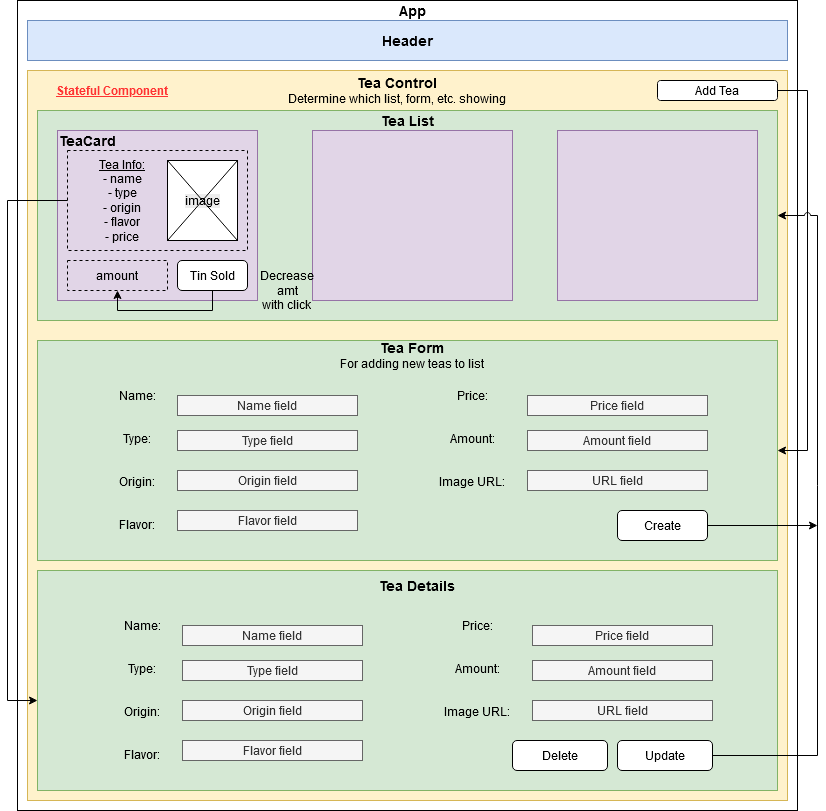

# _[Tea Distributor Redux](https://github.com/TSiu88/https://github.com/TSiu88/tea-distributor-redux)_

#### _Week 17 Friday Independent Assignment for Epicodus, 05.01.2020_

#### By _**Tiffany Siu**_

---
## Table of Contents
1. [Description](#description)
    - [Component Diagram](#component-diagram)
2. [Setup/Installation Requirements](#setup/installation-requirements)
    - [Requirements to Run](#requirements-to-run)
    - [Instructions](#instructions)
    - [Other Technologies Used](#other-technologies-used)
3. [Notable Features](#notable-features)
4. [Specifications](#specifications)
    - [User Stories](#user-stories)
    - [Further Exploration](#further-exploration)
5. [Screenshots](#screenshots)
6. [Known Bugs](#known-bugs)
7. [Support and Contact Details](#support-and-contact-details)
8. [License](#license)
---
## Description

This application is the Week 17 Friday independent assignment for Epicodus' full time Intro to Programming and C#/React course. This is an application made in the previous week to show a React application which has been refactored so that all states use Redux and includes testing, action creators, and action constants.  A component diagram is also to be included to show the structure of the components.

This application is for a tea shop or distributor to keep track of their stock of teas.  It has details on what they tea is named, type, country of origin, price, amount in stock, and a picture for each tea.  Then a button can be clicked on the main page to decrease the stock by one as they are sold.  A single tea's details along with ID number can be seen on a details page.  More teas can be added and require a name, price, and amount minimum to create.

### Component Diagram

## Setup/Installation Requirements

### Requirements to Run

* _Web Browser_
* _Webpack_
* _Node.js_
* _NPM_

### Instructions

*This application may be viewed by:*

1. Download and install Node.js from the [official website](https://nodejs.org/en/download/)
2. Clone the [repository](https://github.com/TSiu88/tea-distributor-redux.git) from my [GitHub page](https://github.com/TSiu88)
3. Use a command line/Bash to move to the project directory with `cd project-directory`
4. Run `npm install` to get all dependencies. 
5. Run `npm run start` to start up the program
6. Open [http://localhost:3000](http://localhost:3000) to view it in the browser.

## Other Technologies Used

* _HTML_
* _CSS_
* _Javascript_
* _React_
* _Redux_
* _Bootstrap 4.4.1_
* _ESLint_
* _Babel_
* _Jest_
* _[Draw.io](https://app.diagrams.net/)_
* _Markdown_

## Notable Features
This project uses Redux in all states to show proof of concept and understanding of using Redux, even if local states do not require to be handled by Redux.

## Specifications

### User Stories

  
Click to expand to view User Stories 

  - [x] As a user, I want to see a list/menu of all available teas. For each tea, I want to see its name, type, origin, flavor, price and an image.
  - [x] As a user, I want to submit a form to add a new tea to a list.
  - [x] As a user, I want to be able to click on a tea to see its detail page.
  - [x] As a user, I want to see how many tins are left for a tea (quantity).
  - [x] As a user, I want to be able to click a button next to a tea whenever I sell a tin of it. This should decrease the number of tins left by 1. Tins should not be able to go below 0.

### Further Exploration

  
Click to expand to view Further Exploration topics 

  - [ ] As a user, I want the option to edit a tea's properties after entering them just in case I make a mistake.
  - [ ] As a user, I want to be able to delete a tea.
  - [x] As a user, I want a tea to update to say "Out of Stock" once it's empty.
  - [x] As a user, I want teas with less than 10 pints to include a message that says "Almost Empty" so I can try some before it's gone!
  - [ ] As a user, I want to have teas prices to be color-coded for easy readability. This could be based on their price, the style of beer or kombucha, or the amount of tins left.
  - [ ] As a user, I want this application to be nicely styled. (Use stylesheets and CSS objects!)

## Screenshots

_Here is a snippet of what the front page looks like:_

_Here is a preview of what the add form looks like:_

  
Click to expand to view a gif of the Quantity Button 

  

  

## Known Bugs

_There are currently no known bugs in this program_

## Support and contact details

_If there are any question or concerns please contact me at my [email](mailto:tsiu88@gmail.com). Thank you._

### License

*This software is licensed under the MIT license*

Background Photo by Alice Pasqual on [Unsplash](https://unsplash.com/photos/xdD-x2Y2SPI)

Copyright (c) 2020 **_Tiffany Siu_**